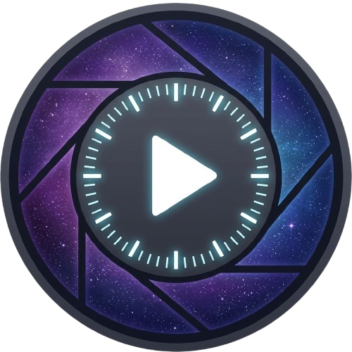

<p align="center">
  
</p>
<h1 align="center">ChronoSnap</h1>
<p align="center"><em>Timelapse Manager</em></p>

A self-hosted timelapse management application that automates the capture, organization, and video creation of timelapse projects. Configure a capture source, set a schedule, and let it run, whether that is a few hours or an entire year.

ChronoSnap runs as a single Docker container with a built-in web interface. No external services, no cloud dependencies, no accounts. Everything stays on your hardware.

### What can you do with it?

- Point it at a security camera and take a daily photo for a year to watch the seasons change
- Attach a USB webcam to a Raspberry Pi and capture a garden growing from seed to harvest
- Pull hourly weather radar images from an HTTP endpoint and compile them into storm progression videos
- Automate a 3D print timelapse by capturing at regular intervals during a print job
- Import a batch of photos you already took and turn them into a timelapse video
- ...and more

---

- [Features](#features)
- [Installation](#installation)
  - [Quick Start](#quick-start)
  - [Docker Compose Configuration](#docker-compose-configuration)
  - [Volumes](#volumes)
  - [Environment Variables](#environment-variables)
  - [Resource Limits](#resource-limits)
- [Capture Sources](#capture-sources)
  - [Network Streams (RTSP / HTTP)](#network-streams-rtsp--http)
  - [Local Cameras](#local-cameras)
- [Importing and Exporting](#importing-and-exporting)
  - [Importing](#importing)
  - [Exporting](#exporting)
- [Scheduling Guides](#scheduling-guides)
  - [Short-Term Capture](#short-term-capture-hours-to-days)
  - [Long-Term Capture](#long-term-capture-weeks-to-months)
  - [Daily Snapshot Over Time](#daily-snapshot-over-time-months-to-years)
- [Template Variables](#template-variables)
  - [Naming Pattern Examples](#naming-pattern-examples)
  - [Text Overlay Examples](#text-overlay-examples)
- [Technical Overview](#technical-overview)
  - [Architecture](#architecture)
  - [Data Storage](#data-storage)
  - [Security and Privacy](#security-and-privacy)
  - [API](#api)
- [Considerations](#considerations)
- [Integrations](#integrations)
  - [Home Assistant](#home-assistant)
- [Technology Stack](#technology-stack)

---

## Features

### Capture

- Schedule captures from seconds to hours with optional daily time windows and date ranges
- Supports RTSP/RTSPS streams, HTTP/HTTPS endpoints, and local USB/Raspberry Pi cameras
- Configurable quality, resolution, and file naming patterns per job

### Video Building

- Build timelapse videos from any capture range with adjustable resolution, framerate, and quality
- Text overlay with dynamic variables (job name, timestamp, frame count, etc.) and live preview
- Automated builds on configurable intervals with webhook notifications
- Download timelapses as GIF with loop/single-play options
- Background processing with real-time progress tracking

### Organization and Sharing

- Tags, favorites, filtering, and side-by-side capture comparison
- Shareable video links with no authentication required for viewers
- Import/export jobs as archives (ZIP, TAR, GZ, RAR, 7Z) with full metadata preservation
- Storage dashboard with per-job usage breakdowns and event logging
- Webhook integration for alerts (compatible with Home Assistant and other platforms)

### Interface

- Dark and light mode with five visual themes
- Installable as a Progressive Web App (PWA) on mobile and desktop
- REST API with built-in Swagger UI at `/docs`

### Integrations

- [Home Assistant custom integration](https://github.com/kernelkaribou/ha-chronosnap) for entity-based automation

---

## Installation

ChronoSnap runs as a Docker container. The only requirement is a host with Docker and Docker Compose installed.

### Quick Start

1. Download the `docker-compose.yml` from this repository:

   [docker-compose.yml](https://raw.githubusercontent.com/kernelkaribou/chronosnap/main/docker-compose.yml)

2. Create the data directories:

   ```bash
   mkdir -p captures timelapses data
   ```

3. Start the container:

   ```bash
   docker compose up -d
   ```

4. Open `http://your-host:8080` in a browser.

That is all you need to get started. The application will initialize its database on first run and generate an API key for external access.

### Docker Compose Configuration

```yaml
services:
  chronosnap:
    image: ghcr.io/kernelkaribou/chronosnap:latest
    container_name: chronosnap
    environment:
      - PUID=1000
      - PGID=1000
      - TZ=America/Chicago
      - LOG_LEVEL=INFO
    ports:
      - "8080:8080"
    volumes:
      - ./captures:/captures
      - ./timelapses:/timelapses
      - ./data:/app/data
      # - ./imports:/imports  # Optional: enable server-path imports
    cap_drop:
      - ALL
    cap_add:
      - CHOWN
      - SETUID
      - SETGID
    security_opt:
      - no-new-privileges:true
    restart: unless-stopped
    healthcheck:
      test: ["CMD", "curl", "-f", "http://localhost:8080/health"]
      interval: 30s
      timeout: 10s
      retries: 3
      start_period: 40s
```

### Volumes

| Container Path | Purpose |
|----------------|---------|
| `/captures` | Stored capture images, organized by job |
| `/timelapses` | Built timelapse videos and thumbnails |
| `/app/data` | SQLite database and application settings |
| `/imports` | Server-side directory for bulk imports |

### Environment Variables

| Variable | Default | Required | Description |
|----------|---------|----------|-------------|
| `PUID` | `0` | No | User ID for file ownership. Set to match your host user. |
| `PGID` | `0` | No | Group ID for file ownership. Set to match your host user. |
| `TZ` | `Etc/UTC` | Recommended | Timezone for scheduling and timestamps. Use a valid tz identifier. |
| `LOG_LEVEL` | `INFO` | No | Logging verbosity: `DEBUG`, `INFO`, `WARNING`, or `ERROR`. |
| `PORT` | `8080` | No | Port the application listens on inside the container. |
| `FFMPEG_TIMEOUT` | `10` | No | Timeout in seconds for ffmpeg frame capture operations. |

### Resource Limits

The included compose file sets resource limits of 2 CPU cores and 2 GB of RAM. These are reasonable defaults. Video encoding is the most resource-intensive operation. Adjust based on your hardware and how frequently you build videos.

---

## Capture Sources

### Network Streams (RTSP / HTTP)

Network sources are the most common setup. Point ChronoSnap at any camera or image endpoint accessible over your network.

**RTSP / RTSPS**: Used by most security cameras and NVR systems. Provide the full stream URL from your camera's configuration.

```
rtsp://192.168.1.100:554/stream1
rtsps://10.0.10.1:7441/your-stream-token
```

**HTTP / HTTPS**: Used for image endpoints, webcam snapshots, weather maps, or any URL that returns an image.

```
http://192.168.1.50:8080/snapshot.jpg
https://radar.weather.gov/ridge/standard/CONUS_0.gif
```

When creating a job, use the "Test URL" button to verify the source is reachable and see a preview of what will be captured.

### Local Cameras

Local cameras (USB webcams, Raspberry Pi camera modules) require the device to be passed through to the Docker container.

**Step 1: Identify the device on your host**

```bash
# List video devices
ls /dev/video*

# Get device details (requires v4l-utils)
v4l2-ctl --list-devices
```

Cameras often register multiple `/dev/video` entries. You want the one associated with "Video Capture", typically the lowest-numbered device for that camera.

**Step 2: Ensure the host user has video group access**

The host user running Docker needs access to the video device. On most Linux systems:

```bash
# Add your user to the video group
sudo usermod -aG video $USER

# Log out and back in for the change to take effect
```

ChronoSnap's entrypoint automatically adds the container user to the `video` group, but the **host user** must also have permission to access the device for Docker to pass it through.

**Step 4: Pass the device into Docker**

Add the device to your `docker-compose.yml`:

```yaml
services:
  chronosnap:
    # ... existing config ...
    devices:
      - /dev/video0:/dev/video0
    # If using a Raspberry Pi camera module, also mount:
    # - /dev/vchiq:/dev/vchiq
```

For Raspberry Pi CSI cameras, ChronoSnap uses `rpicam-apps` (the current Raspberry Pi camera stack, which replaced the older `libcamera-apps`). Additional device nodes and shared library mounts may be needed depending on your Pi model and OS version. On a typical Pi 4 or Pi 5 running Raspberry Pi OS:

```yaml
services:
  chronosnap:
    devices:
      - /dev/video0:/dev/video0
      - /dev/vchiq:/dev/vchiq         # VideoCore interface
    volumes:
      # Standard mounts:
      - ./captures:/captures
      - ./timelapses:/timelapses
      - ./data:/app/data
      # rpicam shared libraries (paths may vary by OS):
      - /usr/lib/aarch64-linux-gnu/libcamera:/usr/lib/aarch64-linux-gnu/libcamera:ro
      - /usr/lib/aarch64-linux-gnu/rpicam-apps:/usr/lib/aarch64-linux-gnu/rpicam-apps:ro
```

You can verify the camera works on the host before configuring Docker:

```bash
# List detected cameras
rpicam-hello --list-cameras

# Test a capture
rpicam-still -o test.jpg

# Find required shared libraries
ldd $(which rpicam-still)
```

**Step 4: Create the job**

In the web interface, select "Local Device" as the source type. Available devices will be listed automatically. Select the device and test the capture before saving.

---

## Importing and Exporting

### Importing

ChronoSnap can import existing images and videos that were not captured by the application. This is useful for bringing in photos from a camera, migrating data from another system, or restoring a previous export.

There are two ways to get files into the import pipeline:

**Browser upload**: Drag and drop files or folders directly into the import dialog, or use the file/folder picker buttons. Supports individual images, videos, and archive files (ZIP, TAR, GZ, RAR, 7Z). Archives are automatically extracted. Maximum upload size is 25 GB per file.

**Server path import**: If you have a large batch of files already on the host machine, mount a directory to `/imports` in the container and browse it from the import dialog. This avoids uploading over the network entirely.

```yaml
volumes:
  - ./imports:/imports  # Optional: only needed for server-path imports
```

The `/imports` volume is optional. If you only plan to import via browser upload, you do not need to mount it.

Once files are staged (either by upload or server path scan), ChronoSnap analyzes them automatically. Images are classified with timestamps extracted from EXIF data, and videos are probed for resolution, duration, and codec information. You can review the results, name the job, and execute the import.

All images in a single import are treated as one job. If you have images from multiple sources or projects, import them separately so each gets its own job with the correct name and metadata. Videos are imported individually as standalone timelapses and can be linked to an existing job during the import process or afterward from the video detail view.

Imported images are organized into the standard folder hierarchy and tracked in the database like any other captures.

If the staged files came from a ChronoSnap export archive, the job metadata (name, interval, time window, tags) is detected and pre-filled automatically. The stream URL is intentionally excluded from exports for privacy.

A fresh install includes a set of default tags (Daily, Weekly, Seasonal, Construction, Project, Nature, Weather, Security, Event, Archival) ready to use for organizing your jobs and videos.

### Exporting

Any job can be exported as a ZIP archive from its detail view. The archive contains:

- All capture images with their original directory structure preserved
- All completed videos and thumbnails
- A `job.json` metadata file with the job configuration, schedule, and tags

Exports are streamed directly to the browser with no temporary files created on the server. Stream URLs that contain credentials are redacted in the metadata before export.

Exported archives can be re-imported into the same or a different ChronoSnap instance. This makes exports a convenient way to back up individual jobs, move data between hosts, or share a timelapse dataset without exposing your network details.

---

## Scheduling Guides

### Short-Term Capture (Hours to Days)

Ideal for 3D prints, construction progress within a day, or weather events.

- **Interval:** 5–30 seconds
- **Time window:** Disabled (capture continuously)
- **Example:** Capture every 10 seconds for 8 hours to record a 3D print. At 30 FPS, that produces roughly 96 seconds of video.

### Long-Term Capture (Weeks to Months)

Ideal for garden growth, construction projects, or seasonal changes.

- **Interval:** 5–60 minutes
- **Time window:** Optional, but useful to capture at consistent lighting
- **Example:** Capture every 15 minutes from sunrise to sunset for 3 months. Auto-build weekly videos to track progress without manual intervention.

### Daily Snapshot Over Time (Months to Years)

Ideal for yearly comparisons, landscape changes, or long-duration monitoring.

- **Interval:** 60 seconds (minimum, used with a time window)
- **Time window:** Set start and end to the same time (e.g., 12:00 to 12:00) to capture once per day at that time
- **Example:** One photo at noon every day for a year. 365 frames at 10 FPS gives a 36-second video showing the full year.

### Tips

- For outdoor captures, using a time window avoids dark nighttime frames that add noise to the video.
- Lower intervals generate more data. A 5-second interval at 1080p can produce several GB per day.
- Auto-build is useful for long-running jobs so you can review progress without manually building videos.
- Set the `TZ` environment variable to match your local timezone so scheduling and timestamps are intuitive.

---

## Template Variables

ChronoSnap uses template variables in two places: **capture naming patterns** (file names for saved images) and **text overlays** (burned-in text on timelapse frames). Variables are wrapped in curly braces and replaced with real values at capture or build time.

Most variables work in both naming patterns and text overlays. A few are specific to one context. See the **Context** column:

| Variable | Description | Example | Context |
|---|---|---|---|
| `{job_name}` | Name of the capture job | `MyJob` | Both |
| `{count}` | Zero-padded capture count | `000001` | Naming |
| `{timestamp}` | Compact datetime (YYYYmmdd_HHMMSS) | `20260319_231400` | Both |
| `{date}` | Date (YYYY-MM-DD) | `2026-03-19` | Both |
| `{time}` | Time (HH:MM:SS) | `23:14:00` | Overlay |
| `{datetime}` | Full date and time | `2026-03-19 23:14:00` | Overlay |
| `{year}` | Four-digit year | `2026` | Both |
| `{month}` | Month, zero-padded | `03` | Both |
| `{full_month}` | Full month name | `March` | Both |
| `{day}` | Day of month, zero-padded | `19` | Both |
| `{hour}` | Hour, 24-hour (00-23) | `23` | Both |
| `{minute}` | Minute (00-59) | `14` | Both |
| `{second}` | Second (00-59) | `00` | Both |
| `{frame}` | Current frame number | `1` | Overlay |
| `{total_frames}` | Total number of frames | `500` | Overlay |

Naming patterns are validated to reject characters that are unsafe across filesystems (`< > : " / \ | ? *`). Use `{hour}{minute}{second}` to build a filesystem-safe time format for filenames. `{time}` and `{datetime}` are overlay-only because they contain colons and spaces.

### Naming Pattern Examples

Configure the default pattern in **Settings → Default Naming Pattern**, or override per-job when creating a capture job.

- **Default:** `{job_name}_{count}_{timestamp}` → `MyJob_000001_20260319_231400.jpg`
- **Date parts:** `{job_name}_{year}-{month}-{day}_{count}` → `MyJob_2026-03-19_000001.jpg`
- **Month name:** `{job_name}_{full_month}_{count}` → `MyJob_March_000001.jpg`
- **Custom time:** `{job_name}_{count}_{hour}{minute}{second}` → `MyJob_000001_231400.jpg`

### Text Overlay Examples

Enable text overlay when building a timelapse video. Each variable is resolved per-frame using that frame's capture timestamp.

- **Date stamp:** `{job_name} - {date} {time}` → `MyJob - 2026-03-19 23:14:00`
- **Frame counter:** `Frame {frame} of {total_frames}` → `Frame 1 of 500`
- **Compact:** `{month}/{day} {hour}:{minute}` → `03/19 23:14`
- **Month name:** `{full_month} {day}, {year}` → `March 19, 2026`

---

## Technical Overview

### Architecture

ChronoSnap is a single-container application with three layers:

- **Backend:** Python with FastAPI, handling scheduling, capture, video processing, and the REST API
- **Frontend:** Vanilla JavaScript served as static files through the same container. No build toolchain or framework dependencies
- **Database:** SQLite with WAL journaling for safe concurrent access from the scheduler, API, and video processing threads

The scheduler runs as a background thread, managing capture timing for all active jobs. Video builds are processed by spawning ffmpeg as a subprocess with real-time progress tracking. There are no external service dependencies. Everything runs within the single container.

### Data Storage

All captured images are stored on disk in a hierarchical directory structure organized by job, year, month, day, and hour. File paths are stored as relative references in the database, making the capture directory portable. Built videos and their thumbnails are stored in the timelapses volume with a similar per-job structure.

The SQLite database holds job configuration, capture metadata, video records, tags, shared links, and application settings. It is stored in the `/app/data` volume.

**Storage recommendation:** Keep the database on local storage (SSD preferred). SQLite relies on filesystem locking, which does not work reliably over network mounts (NFS, SMB). Capture and video volumes can be on network storage if needed, though local storage will provide better performance during video builds.

### Security and Privacy

ChronoSnap is designed for self-hosted use. No data leaves your network unless you explicitly configure webhooks or share a video link.

**Authentication:**
- All API endpoints require an API key (auto-generated, visible in Settings)
- The web interface is exempt from key requirements when accessed from the same origin
- Shared video links are the only public-facing routes

**Network hardening:**
- Security response headers on all requests (content type enforcement, frame embedding prevention, referrer restrictions, permission restrictions)
- CORS restricted to same-origin only
- Path traversal protections on all file-serving endpoints
- Parameterized database queries throughout

**Container hardening:**
- All Linux capabilities dropped by default, with only file ownership capabilities added back
- Privilege escalation prevention enabled
- Configurable resource limits for CPU and memory
- Health check endpoint for container orchestration

**Data privacy:**
- Stream URLs (which may contain camera credentials) are redacted from all exports
- Shared video links serve only the video file with restricted content security policies
- No telemetry, analytics, or external calls (aside from an optional GitHub version check)

### API

The full API is documented interactively at `/docs` (Swagger UI) when the application is running. All endpoints are under `/api/` and require authentication via the `X-API-Key` header or `api_key` query parameter.

**Example: Create a capture job**

```bash
curl -X POST http://localhost:8080/api/jobs/ \
  -H "X-API-Key: YOUR_KEY" \
  -H "Content-Type: application/json" \
  -d '{
    "name": "Front Yard",
    "url": "rtsp://192.168.1.100:554/stream",
    "stream_type": "rtsp",
    "interval_seconds": 300,
    "start_datetime": "2026-01-01T08:00:00",
    "end_datetime": "2026-12-31T20:00:00",
    "time_window_enabled": true,
    "time_window_start": "08:00",
    "time_window_end": "18:00"
  }'
```

**Example: Build a video from captures**

```bash
curl -X POST http://localhost:8080/api/videos/ \
  -H "X-API-Key: YOUR_KEY" \
  -H "Content-Type: application/json" \
  -d '{
    "job_id": 1,
    "name": "January Timelapse",
    "framerate": 30,
    "quality": "high",
    "resolution": "1920x1080",
    "start_time": "2026-01-01T00:00:00",
    "end_time": "2026-01-31T23:59:59"
  }'
```

**Example: List all jobs and their status**

```bash
curl http://localhost:8080/api/jobs/ \
  -H "X-API-Key: YOUR_KEY"
```

---

## Considerations

### Timezone Configuration

Set the `TZ` environment variable to your local timezone. Scheduling, time windows, and capture timestamps all rely on this. Using UTC (the default) works but may make time-window scheduling less intuitive.

### Storage Planning

Capture frequency and image resolution are the primary drivers of storage usage. Rough estimates for 1080p JPEG captures:

- Every 60 seconds: ~1.5 GB/day
- Every 5 minutes: ~300 MB/day
- Once per day: ~2 MB/day

### Backup

Back up the `/app/data` directory (contains the database) and the `/captures` volume. The `/timelapses` volume can be recreated from captures if needed. Export archives are a convenient way to create portable backups of individual jobs.

### Job Deletion

Deleting a job removes all its captures, videos, thumbnails, and database records. This is irreversible. Export the job first if you may want the data later.

### Network and Camera Reliability

Cameras and network streams can be intermittent. ChronoSnap tracks consecutive failures per job and sends webhook notifications when the warning threshold is reached. When a job recovers, a recovery notification is sent. The capture scheduler continues retrying on the configured interval.

---

## Integrations

### Home Assistant

[ha-chronosnap](https://github.com/kernelkaribou/ha-chronosnap) is a custom Home Assistant integration that turns entity state changes into automated timelapses. Install it via HACS or manually, connect it to your ChronoSnap instance, and create profiles that start and stop capture jobs based on any entity in Home Assistant.

**Use cases:**

- Timelapse every 3D print from start to finish, triggered by your printer's status entity
- Capture what happens when the house is detected as empty
- Timelapse a storm rolling through your backyard, triggered by a weather sensor
- Record a garage workbench session whenever a presence sensor activates

**Key features:**

- UI-based configuration with entity and state selectors
- Multiple profiles running simultaneously on different cameras
- Fixed interval or target duration capture modes
- Start delay, stop debounce, and exclude states for reliable triggering
- Auto-cleanup of jobs and raw frames after video build
- Per-profile sensors for status and capture count in Home Assistant
- Server-level sensors for jobs, videos, captures, and disk usage

See the [ha-chronosnap README](https://github.com/kernelkaribou/ha-chronosnap#readme) for installation and configuration details.

---

## Technology Stack

| Component | Technology |
|-----------|------------|
| Backend | Python 3.11, FastAPI, Uvicorn |
| Frontend | Vanilla JavaScript, Alpine.js (minimal), HTML/CSS |
| Database | SQLite with WAL journaling |
| Video Processing | ffmpeg |
| Container | Docker (Python slim base image) |
| Authentication | API key (stateless, per-request validation) |

## License

MIT License. See [LICENSE](LICENSE) for details.

## Author

Maintained by [kernelkaribou](https://github.com/kernelkaribou)

## Disclaimer

This was a shell script I had personally made before but wanted something easier to configure and schedule on a larger scale. This application was built almost exclusively using vibe coding. If you are reading this you should know because some people get upset. This was an idea I carried around for a while and AI made it actually happen. I can't imagine that I will be making much changes to it as its more of a utility than an application but intend to keep it functioning as long as I can. Do whatever you want with it, I don't care.
